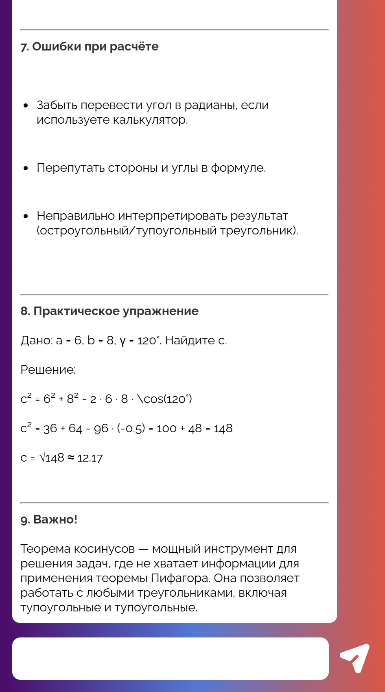
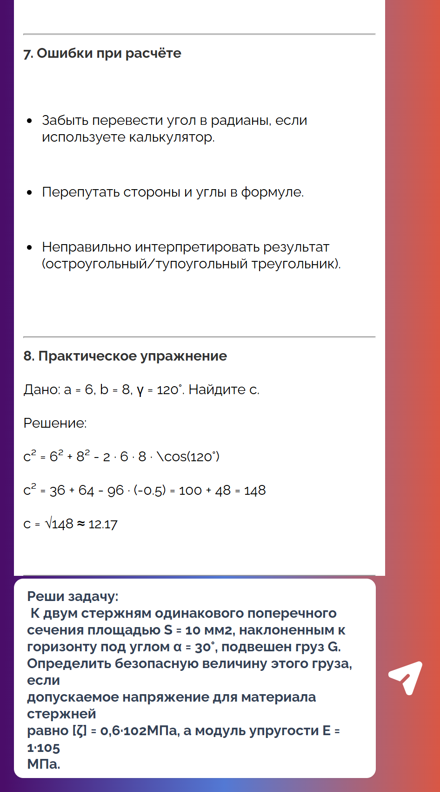
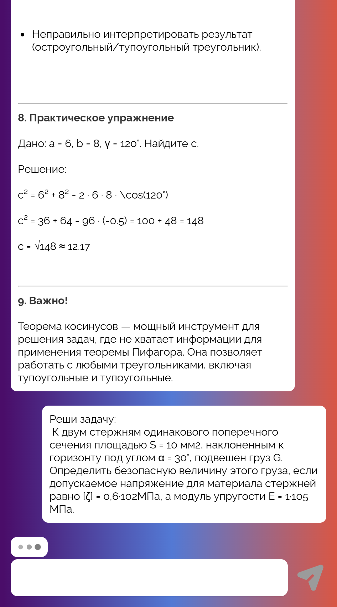
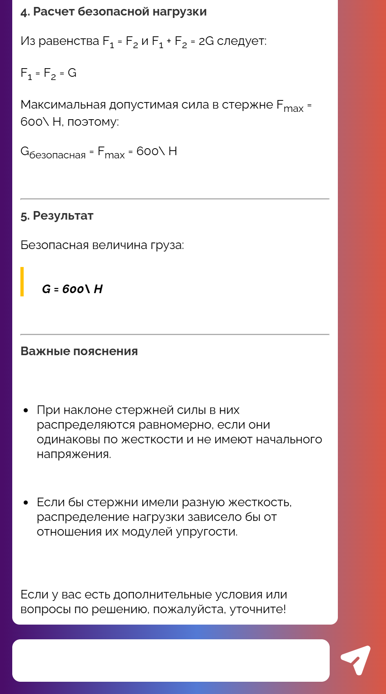
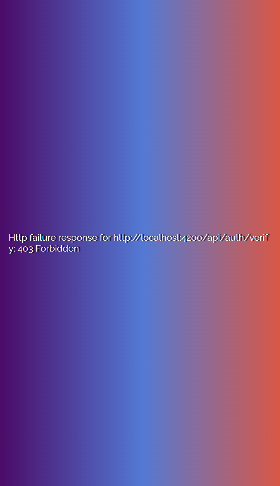

# 🤖 Alibaba Deep Researcher AI Agent

<div align="center">

[](https://github.com/kafpliz/Alibaba-Deep-Researcher-Ai-Agent/stargazers)
[](LICENSE)
[](https://nodejs.org)

</div>

## 🚀 Обзор

**Alibaba Deep Researcher AI Agent** - это полнофункциональное веб-приложение, построенное на основе передовой технологии [Alibaba-NLP/DeepResearch](https://github.com/Alibaba-NLP/DeepResearch). Наш агент предоставляет интеллектуальные исследовательские возможности с расширенными функциями взаимодействия.

<div align="center">

## 🖥️ Скриншоты Интерфейса

<div style="display: grid; grid-template-columns: repeat(3, 1fr); gap: 15px; margin: 20px 0;">

<div>

<p style="text-align: center; margin: 8px 0 0 0; font-size: 12px; color: #666;">Главная страница</p>
</div>

<div>

<p style="text-align: center; margin: 8px 0 0 0; font-size: 12px; color: #666;">Диалог с агентом</p>
</div>

<div>

<p style="text-align: center; margin: 8px 0 0 0; font-size: 12px; color: #666;">История запросов</p>
</div>

<div>

<p style="text-align: center; margin: 8px 0 0 0; font-size: 12px; color: #666;">Настройки</p>
</div>

<div style="grid-column: span 2;">

<p style="text-align: center; margin: 8px 0 0 0; font-size: 12px; color: #666;">Обработка ошибок</p>
</div>

</div>

*Современный веб-интерфейс для взаимодействия с AI агентом*

</div>


## 🏗 Архитектура Приложения

<div align="center">

Alibaba-Deep-Researcher-Ai-Agent/
├── 📂 Ветка: client
│ ├── src/
│ │ ├── app/
│ │ │ ├── core/ # Сервисы API и взаимодействия компонентов
│ │ │ ├── pages/ # Компоненты
│ │ │ └── shared/ # Промежуточное ПО
│ │ └── main.ts
│ ├── public/
│ ├── package.json
│ └── README.md
│
├── 📂 Ветка: server
│ ├── src/
│ │ ├── auth/ # Обработчик маршрутов auth
│ │ ├── chat/ # Обработчик маршрутов chat
│ │ ├── generate-webapp-url/ # Обработчик маршрутов generate-webapp-url
│ │ └── shared/ # Промежуточное ПО
│ ├── config/
│ ├── package.json
│ └── README.md
│
└── 📂 Ветка: main
├── README.md # Основная документация
├── .gitignore
└── docs/ # Исходники

*Модульная архитектура с разделением на клиент и сервер в рамках одного репозитория*

</div>


## ✨ Ключевые Возможности

### 🔍 **Глубокое Исследование**
- Многоуровневый анализ запросов с использованием Alibaba DeepResearch
- Автоматический поиск релевантной информации
- Контекстно-зависимые ответы

### 💬 **Продвинутый Диалог**
- Поддержание контекста беседы
- Полная история запросов и ответов
- Адаптация под стиль общения пользователя

### 🔌 **API Интеграции**
- Гибкая система подключения внешних сервисов
- RESTful API для расширения функциональности
- Webhook поддержка для реального времени

### 🔐 **Система Безопасности**
- Токен-базированная аутентификация
- Возможная реализация система подписок и лимитов
- Защита от злоупотреблений

### 📱 **Telegram Mini App**
- Готовая интеграция с Telegram платформой
- Мобильная адаптация для удобного доступа


## 🏗 Архитектура Приложения

Alibaba-Deep-Researcher-Ai-Agent/
├── 📂 Ветка: client
│   ├── src/
│   │   ├── app/
|   |   |   |── core    # Сервисы API и взаимодействия компонентов
|   |   |   |── pages   # Компонетны
|   |   |   └── shared  # Промежуточное ПО
│   │   └── main.ts        
│   ├── public/
│   ├── package.json
│   └── README.md
│
├── 📂 Ветка: server
│   ├── src/
│   │   ├── auth/                   # Обработчик маршутов auth
│   │   ├── chat/                   # Обработчик маршутов chat
│   │   ├── generate-webapp-url/    # Обработчик маршутов generate-webapp-url
│   │   └── shared/    # Промежуточное ПО
│   ├── config/
│   ├── package.json
│   └── README.md
│
└── 📂 Ветка: main
    ├── README.md          # Основная документация
    ├── .gitignore
    └── docs/              # Исходники

## 🚀 Быстрый Старт

### 📋 Предварительные Требования
- Node.js 18 или выше
- npm или yarn
- Доступ к репозиторию проекта

### ⚡ Порядок Запуска Приложения

#### 1. Клонирование Репозитория

```bash
# Клонируем репозиторий
git clone https://github.com/kafpliz/Alibaba-Deep-Researcher-Ai-Agent.git

# Переходим в папку проекта
cd Alibaba-Deep-Researcher-Ai-Agent

# Переходим в ветку client
git checkout client

# Устанавливаем зависимости
npm i

# Запускаем клиентское приложение
npm start


# Открываем новое окно терминала
# Переходим в папку проекта (если нужно)
cd Alibaba-Deep-Researcher-Ai-Agent

# Переходим в ветку server
git checkout server

# Устанавливаем зависимости
npm i

# Запускаем серверное приложение
npm start

## 🎯 Важные Действия После Запуска
После успешного запуска обоих частей приложения необходимо получить доступ к веб-приложению:

-🔗 Шаг 1: Генерация URL доступа
Откройте браузер и перейдите по адресу:
http://localhost:3000/api/generate-webapp-url?user=980448451

Дождитесь ответа от сервера в формате JSON:
{
    "url": "http://localhost:4200/?token=2ae5c6d711266e26fb5aa7ca82a414c5:fa086d885ca8b57d35e39279f1984a1efc31ab5b1250fd8b334fdf0b9c26c762db6e3efbe0f837dbc9ed488c2a1805e9"
}

- 🔗 Шаг 2: Переход по полученной ссылке
Скопируйте URL из поля url в ответе
Перейдите по этой ссылке в браузере
Начните работу с AI агентом!